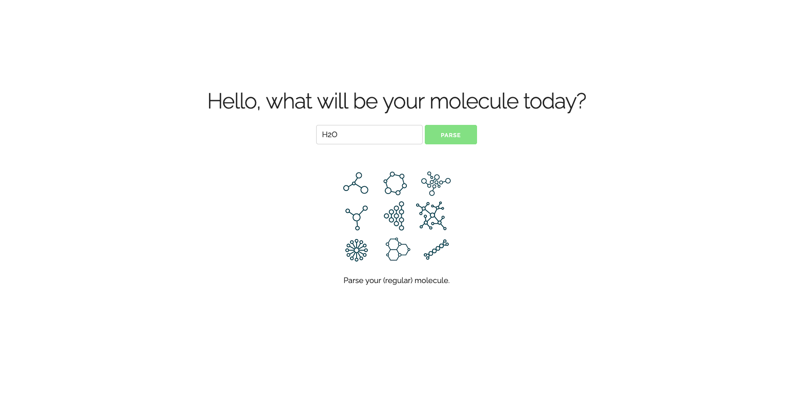
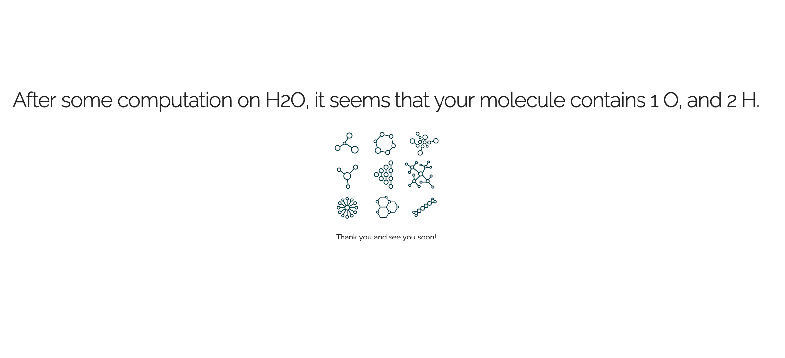

# j-case: A simple web application for parsing molecules

## Content

This web application takes a molecule as input and outputs its atoms. The application is ready to be hosted on AWS.

Input:

Output:


## Installation

Requirements:
```
python==3.6.11
click==7.1.2
Flask==1.0.2
itsdangerous==1.1.0
Jinja2==2.11.2
MarkupSafe==1.1.1
Werkzeug==1.0.1
WTForms==2.3.2
```
Then,
```bash
git clone https://github.com/GregoireMialon/j-case.git
cd j-case
export PYTHONPATH=$PWD:$PYTHONPATH
python application.py
```